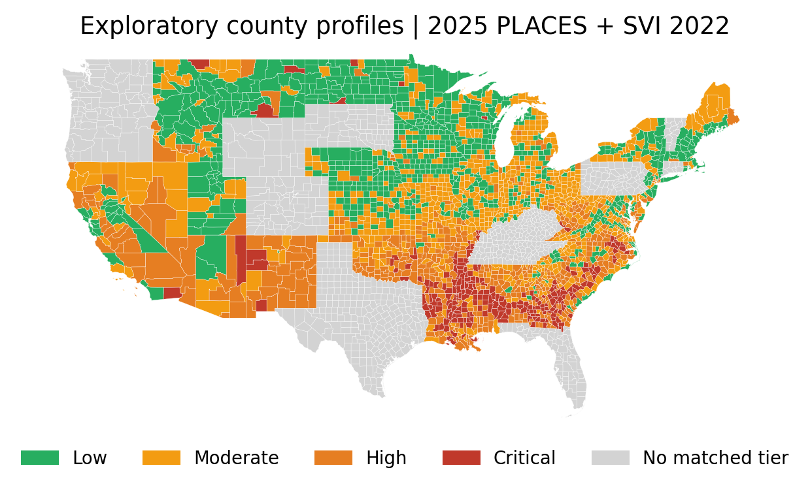

# County Health and Social Vulnerability
**Donghang Zou · Global AI Internship**

How do social conditions accompany diabetes and hypertension across U.S. counties, and what patterns emerge when counties are grouped by disease burden and vulnerability? This project brings together CDC PLACES and the CDC Social Vulnerability Index (SVI) to explore those questions through data preparation, correlation analysis, clustering, and maps.

Start with [the full analysis notebook](assignment.ipynb) for the step-by-step investigation, or [the executed code sample](code_sample/code_sample.ipynb) for a compact walkthrough of the latest snapshot. Both include explanations and computed output. A [two-page PDF excerpt](code_sample/code_sample.pdf) presents the latest-snapshot code, results, and county map. The [sample notes](code_sample/README.md) describe its scope and how to reproduce it.

## Data and approach

| Input | Use in the analysis |
|---|---|
| CDC PLACES releases 2021–2025 | County estimates of chronic disease, health behaviors, access, and social needs |
| CDC/ATSDR SVI 2020 and 2022 | Overall social vulnerability and four theme rankings |
| Cached county GeoJSON | County boundaries for interactive and static maps |

The full notebook stacks five release snapshots into a 15,341-row county panel. Its 2019–2023 snapshot labels refer to each release's newest measurement year, rather than the year of every variable. SVI 2020 is paired with releases 2021–2022 and SVI 2022 with releases 2023–2025. The latest cross-section uses the **2025 PLACES release**, with disease outcomes from 2023, some measures from 2022, and SVI 2022. The cached 2020 PLACES file is examined during exploration but excluded from the FIPS join because it lacks county identifiers.

Preparation preserves five-character FIPS identifiers, removes national aggregates, retains suppressed estimates as missing, replaces SVI's −999 placeholders, and checks one-to-one county joins. Age-adjusted prevalence is preferred to reduce differences arising from county age structures. The full notebook records measurement years and audits coverage before interpreting results.

Pearson correlations are calculated for diabetes and hypertension. A reusable sampling comparison then asks how those associations change when every factor is evaluated on the same counties. For clustering, both outcomes and factors with mean absolute correlation of at least 0.40 across the two outcomes are standardized before fitting K-Means. Four profiles are ordered using their standardized diabetes, hypertension, and overall SVI centers.

## Findings from the latest snapshot

There are **2,956 counties** with both disease outcomes and overall SVI. Food insecurity, housing insecurity, and transportation barriers have the strongest positive associations with diabetes among the factors examined: **r = 0.937, 0.921, and 0.914**, respectively, each using 2,299 counties.

Physical inactivity illustrates why the sample matters: its diabetes correlation is **0.873 across 2,956 counties**, falling to **0.850 on the common 2,299-county sample** used by these four factors. The ordering remains the same, but the comparison shows how geographic coverage affects the magnitudes.

The 16-feature clustering retains **2,299 counties**, with the following unweighted county means:

| Profile | Counties | Diabetes (%) | Hypertension (%) | Overall SVI |
|---|---:|---:|---:|---:|
| Low | 765 | 9.09 | 29.76 | 0.190 |
| Moderate | 788 | 10.77 | 33.31 | 0.456 |
| High | 508 | 12.55 | 36.75 | 0.754 |
| Critical | 238 | 15.79 | 42.94 | 0.895 |

Higher-burden profiles concentrate in the Deep South. The four-profile solution has a silhouette score of **0.203**, indicating substantial overlap; the notebook's K search gives a higher score for two clusters. Four groups provide descriptive detail, without establishing four naturally separate or clinically validated risk categories.



Complete-case filtering excludes **657 counties (22.2%) across nine states** represented in the latest snapshot. Grey map areas have no matched profile. The static view excludes Alaska, Hawaii, and Puerto Rico; nine clustered Connecticut planning regions also lack matching geometry in the cached boundary file.

These are county-level associations, not causal effects or individual risk estimates. Each county receives equal weight, so the summaries are not national prevalence estimates. Different measurement years, changing coverage, and the underlying small-area estimation methods also limit comparisons across releases.

## Repository guide

| Location | Contents |
|---|---|
| [assignment.ipynb](assignment.ipynb) | Full exploration, preparation, coverage checks, correlations, and clustering |
| [raw_data/](raw_data/) | Cached PLACES and SVI source CSVs |
| [processed_data/](processed_data/) | Merged panel, measurement-year provenance, and county boundaries |
| [results/](results/) | Full-analysis figures, county assignments, coverage tables, and interactive maps |
| [code_sample/](code_sample/) | Executed excerpt, matching Python script, static figures, result tables, and verification records |
| [ProgressReport/](ProgressReport/) | Historical internship progress reports and final write-up |

The interactive [diabetes/SVI map](results/fig5_diabetes_svi_map.html) and [county-profile map](results/fig9_risk_tier_map.html) can be opened locally in a browser. Older output filenames ending in `2023` refer to the latest snapshot label, corresponding to the 2025 release.

## Reproduce the analysis

Use a Python environment with the following packages:

```sh
python -m pip install pandas numpy matplotlib seaborn scikit-learn scipy requests folium branca jupyter nbformat nbclient ipykernel
```

Open `assignment.ipynb` with that environment and run all cells from the repository root. Source CSVs and county boundaries are already cached. Running the full notebook regenerates the processed panel and files in `results/`.

To run only the compact latest-snapshot analysis, which writes into `code_sample/`, use:

```sh
python code_sample/code_sample.py
```

To execute the excerpt notebook in a fresh kernel and verify its results against the full analysis:

```sh
python code_sample/_validation/execute_and_verify.py
```

The verification checks correlations, feature selection, county profiles, and the silhouette score against the saved analysis, then checks hashes of the original notebook and data/output files. See [the sample notes](code_sample/README.md) for the tested environment and saved artifacts.
